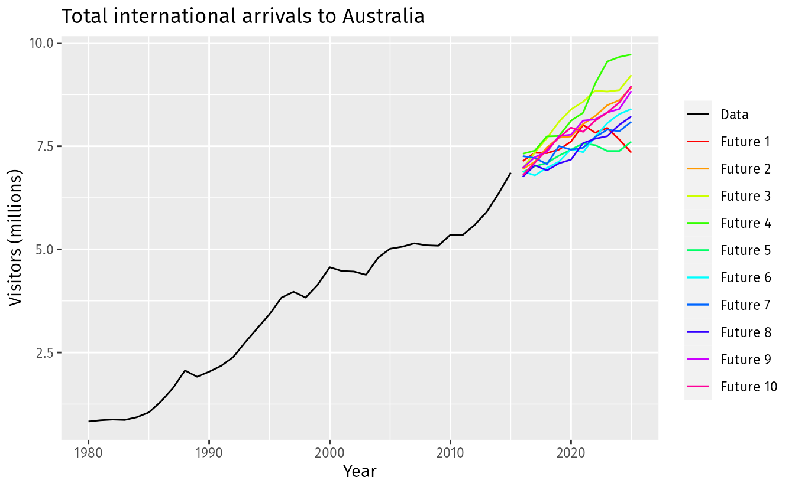
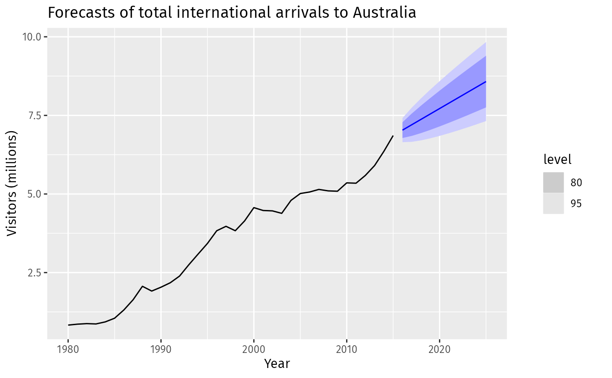

# The statistical forecasting perspective




```
Fig 1.2: Total international visitors to Australia (198-2015) along with ten possible features
```



```
Fig 1.3: Total international visitors to Australia (1980-2015) along with 10-year forecasts and 80% and 95% prediction intervals
```

---

## Nature of Forecasting as a prediction of Unknown Variables
### Unknown variables as Random (a.k.a. as Uncertain)
- Rorecasting involves predicting unknown variables.
  - 예측은 아직 알지 못하는 것에 대한 추측
- These unknowns are considered random variables $y$ until their actual values are realized.
  - 실제 결과를 보기 전까지 이 추측은 불확실한 확률변수.
### Varying Ranges of Potential Values (Different guesses for different times)
- The forecasted variable can take on a range of potential values
  - Guessing what might happen next month is easier than guessing a year from now.
- The actual value remains unknown until observed or measured at a specific point in time.
  - Closer events are easier to guess; farther ones are harder.

## Temporal influence on Forecasting uncertainty (Time changes how sure we are)
### Temporal proximity and Forecasting Accuracy (Closer EQ More certain)
- Proximity in time affects the certainty of forecasts
  - If something's going to happen soon, we can guess better
- Forecasts for the near future usually possess a narrower range of potential values.
- As the time horizon extends, the variability of potential values increases, leading to greater uncertainty.
### Uncertainty Decreases with Approach of Event (Farther EQ More uncertain)
- Generally, as the event being forecasted gets closer, the uncertainty surrounding the forecasted variable diminishes.
- Forecasting farther into the future leads to increased uncertainty due to greater variability in potential outcomes.

## Diversification of potential futures (THinking about lots of possible futures)
### Imagining multiple scenarios
- Forecasting involves envisioning multiple potential futures
  - Forecasting means thinking about many possible futures
- Each scenario presents a different outcome or value for the variable being forecasted
  - Each guess we make is like a different story about what might happen.

### Illustration with International Arrivals to Australia (Looking at past and possible future Arrivals)
- The passage refers to an illustration (Fig 1.2) depicting total international arrivals to Australia from 1980 to 2015.
- Ten potential future scenarios for the period from 2016 to 2025 are displayed, showcasing diverse potential outcomes.

---

## Prediction intervals, Estimating future values, Visual Representation, forecast distribution, &amps; Point Forecasts

1. Estimating Future values
   1. Forecasts estimate the central tendency of possible values for a random variable.
   2. They represent the midpoint of the range of potential outcomes
2. Prediction intervals
   1. Prediction intervals accompany forecasts, offering a probable range for the random variable
   2. A 95% prediction interval suggests a range within which the actual future value should fall with 95% probability
3. Visual representation
   1. Instead of displaying individual potential outcomes, graphs often depict prediction intervals
   2. Figure 1.3 showcases 80% and 95% prediction intervals for Australian international visitors' future values
4. Point forecasts
   1. The blue line in Fig 1.3 signifies the average of potential future values, termed point forecasts.
   2. Point forecasts provide a singular value estimation for the future variable.


The forecast distribution refers to the set of potential values a random variable $y_t$ could take, along with their associated probabilities, given all the information observed up to a particular point in time $t$, denoted as $I$. This distribution represents the range of possible outcomes for $y_t$ based on the available information.

In essence:
- **Forecast Distribution**: The collection of potential values that the random variable $y_t$ could assume, considering the known information $I$ and their respective probabilities.
- **Forecast**: Typically refers to the average value of the forecast distribution, denoted as $\hat{y}_t$, representing the expected or average value of $y_t$ considering all available information.

The notation $y_t | I$ represents the random variable $y_t$ given the observed information $I$, and the forecast distribution involves understanding the range of values this variable could take based on that information.
